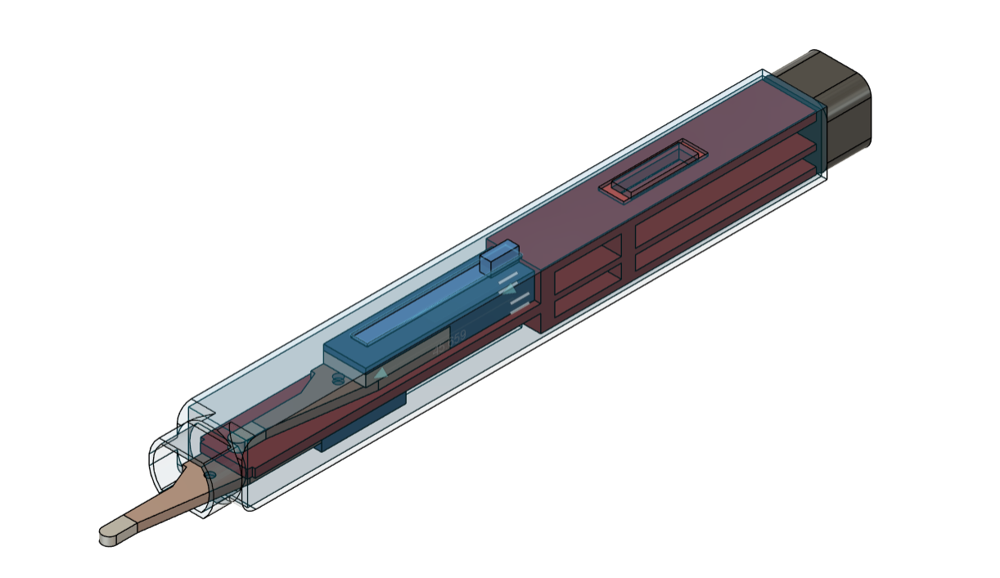
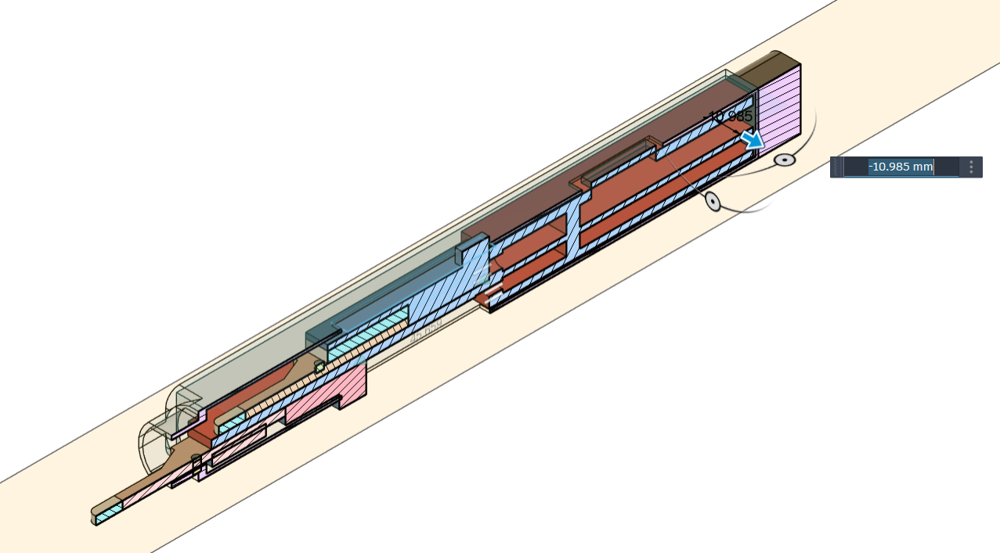
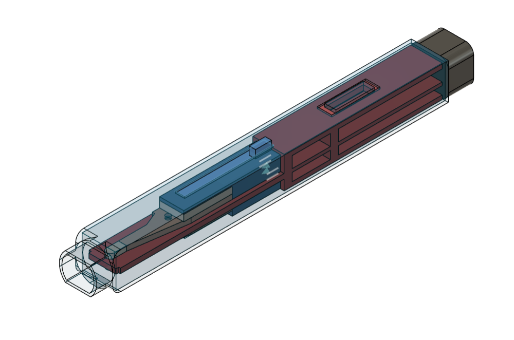

# Thermoelectric Temperature Controller

An Arduino based heating and cooling controller using a Peltier module and a heater. The system uses thermistors to measure temperature, a potentiometer to set the target temperature, buttons to select the mode, and a small OLED display to show the temperature and output status.

## Prototype

## Features

* Heating using a 12V heater
* Cooling using a Peltier module
* Two 10K NTC thermistors for temperature measurement
* Adjustable temperature using a potentiometer
* 3 buttons:

  * B1 — OFF
  * B2 — COLD
  * B3 — HOT
* 0.91" 128x32 I2C OLED display
* Arduino Nano based controller
* L298N used for switching the heater and Peltier in the prototype
* Heater and Peltier are never operated at the same time

## How It Works

The potentiometer sets the target temperature. The thermistors continuously measure the heater and Peltier temperatures.

In HOT mode, the heater turns ON when the measured temperature is below the target and turns OFF when the target temperature is reached.

In COLD mode, the Peltier turns ON when the measured temperature is above the target and turns OFF when the target temperature is reached.

The OLED displays the selected mode, target temperature, heater temperature, Peltier temperature, and output status.

## Hardware

* Arduino Nano
* 0.91" 128x32 I2C OLED
* 2 × 10K NTC thermistors
* 10K potentiometer
* 3 × push buttons
* Peltier module
* 12V heater
* L298N motor driver
* 5V/3A power supply for heater
* 8V/3A supply for Peltier
* Heatsink and thermal hardware

## Project Status

This is currently a working prototype. The next stage is to move from separate modules and prototype wiring to a custom PCB, improved thermal/mechanical design, and a compact enclosure suitable for a final product.

## Future Improvements

* Custom PCB
* Replace L298N with MOSFET-based power switching
* Smaller electronics
* Better temperature calibration
* Improved thermal insulation
* Custom plastic enclosure
* More accurate temperature control
* Production-oriented design
